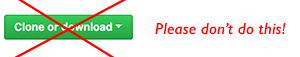

# 

> 

---

## Table of Contents

<!-- toc -->

---

## About

The instructions below will help you to install extension **I (Stefan Walther)** have created. All Qlik Sense extensions I have created, follow the same rules.

__Note: Other authors might very likely follow different approaches.___

## Download the Extension

- There is a folder called `build`. 
- Download the file called `%extension-name%_latest.zip`
- Follow the instructions below

## Installing Qlik Sense Extensions

### Installing on Qlik Sense Desktop

Follow the instruction [here](http://help.qlik.com/en-US/sense-developer/September2017/Subsystems/Extensions/Content/Howtos/deploy-extensions.htm).

### Installing on Qlik Sense Server

Follow the instructions [here](http://help.qlik.com/en-US/sense-developer/September2017/Subsystems/Extensions/Content/Howtos/deploy-extensions.htm).

## FAQ

### I am getting error XYZ

First of all don't do download the entire GitHub repository, this is the most common mistake.

You are then downloading the entire GitHub repository, containing (potentially) multiple versions of an extensions.  
Importing the resulting .zip file will fail when importing in Qlik Sense.

### I am getting an error uploading the extension to Qlik Sense Server, what can I do?  

As you upload a .zip file to Qlik Sense Server I first recommend to unzip the file locally to have a look into the content of the .zip file:

- You should see a .qext file at the root of the .zip file's content

### Why can't I just download the GitHub project?  

I have structured all my extensions in the same way:

- There is a `./build` directory where you can download multiple versions of an extension.

If you download the entire GitHub repository, it will contain most likely multiple .zip files containing a specific version of an extension.  
The solution is simple: Go to the `./build` directory and download the desired version, by default the go for the file %extension-name%_latest.zip

## About

### Author


***

